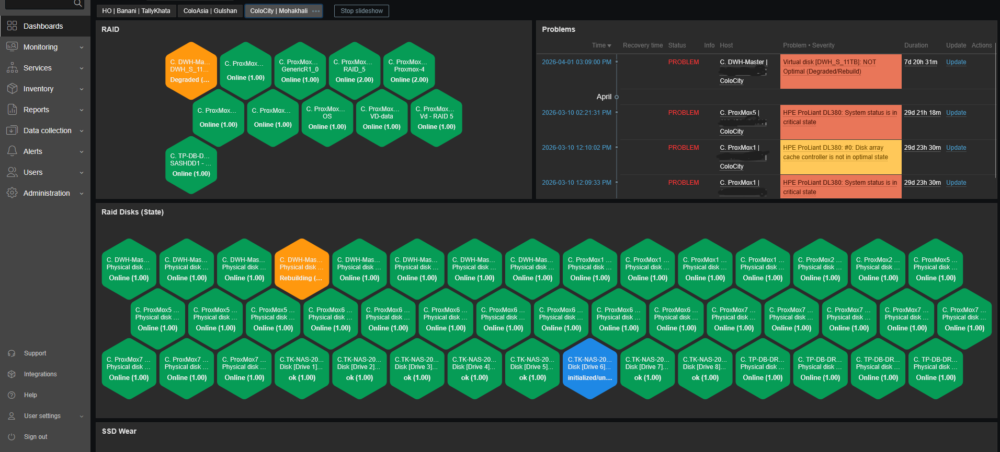
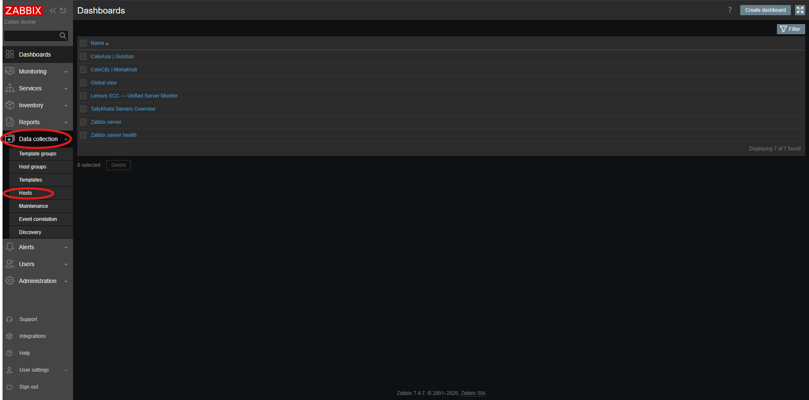
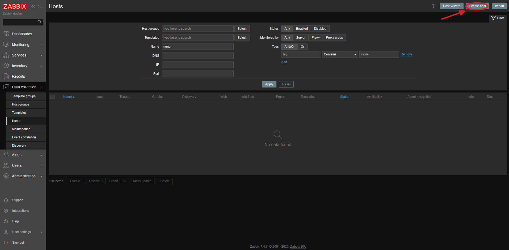
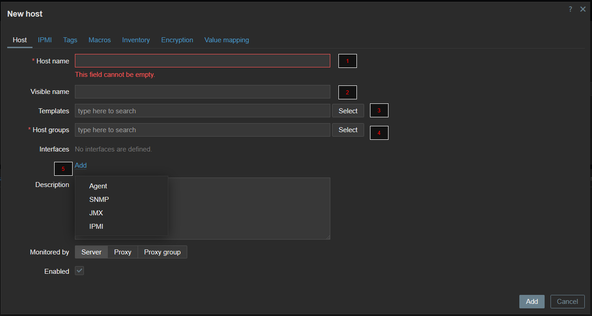
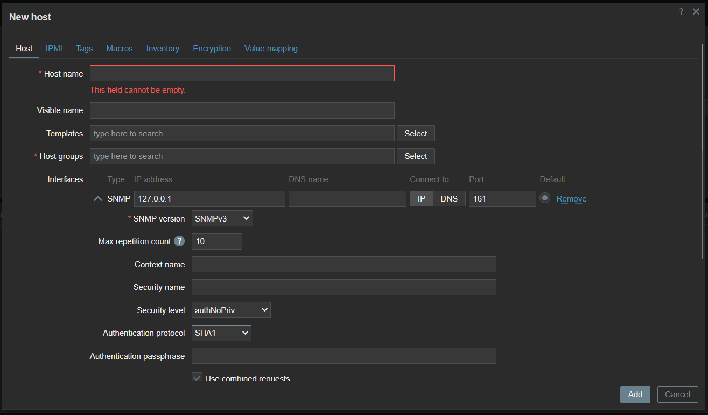

# Zabbix Infrastructure Monitoring



A production-oriented collection of **Zabbix 7.4 hardware monitoring templates** for mixed infrastructure environments.

This repository documents and packages a monitoring setup built around this workflow:

> **Read vendor MIBs → identify useful OIDs → build Zabbix templates → normalize statuses into a shared numeric model → display them consistently in dashboards and honeycomb tiles.**

It combines:

- **SNMP-based vendor templates** for Dell, HPE, IBM, Lenovo, and Synology
- **Agent-based Proxmox RAID SMART monitoring** for MegaRAID-backed disks using `smartctl`
- **Normalized value mapping** so dashboard tiles can use consistent color logic
- **Discovery-heavy monitoring** for disks, RAID, power, fans, memory, CPU, and other hardware components

---

## What is a monitoring tool?

A monitoring tool is a platform that continuously checks the health, status, and behavior of infrastructure components such as:

- servers
- disks and RAID controllers
- fans, PSUs, and temperature sensors
- memory and CPU
- network interfaces
- storage appliances and NAS devices

Instead of engineers manually logging into each device and checking hardware one by one, a monitoring tool collects the data centrally, evaluates it, and highlights what is healthy, degraded, or failed.

In this repository, **Zabbix** is the monitoring platform used to collect hardware data through **SNMP** and **Zabbix Agent 2**.

---

## Why monitoring is needed

In our current environment, hardware checks often have to be done **manually** across multiple devices and vendors.

That creates several operational problems:

- it is **time-consuming**
- it is **error-prone**
- it depends too much on **manual effort**
- it is difficult to maintain a **consistent checking process**
- hardware issues can be **missed or noticed late**

When the process is manual, teams usually need to open each server interface, review health states, compare disk or RAID conditions, and repeat the same work again and again. As the environment grows, this becomes harder to sustain.

---

## Existing problem statement

The main reason for building this setup was simple: **the company should not need to manually check every single hardware component every time it wants to confirm system health.**

Before this monitoring approach:

- hardware status checks were not centralized
- checks were repetitive and manual
- different vendors exposed information differently
- there was no single automated view for quick health validation

This repository solves that by creating a structured monitoring approach where Zabbix can:

- automatically collect hardware data
- discover components dynamically
- normalize vendor-specific states
- show clear dashboard colors and tiles
- reduce manual checking effort

So the value of this repository is not only in the templates themselves — it is in turning a **manual hardware validation process** into a more **automated, repeatable, and operationally useful monitoring system**.

---

## Why this repository exists

Zabbix hardware monitoring often becomes messy in real environments because each vendor exposes:

- different MIB trees
- different status texts and numeric values
- different discovery patterns
- different dashboard behavior

The goal of this repo is to make those templates **portable, understandable, and reusable**.

This repo is especially useful if you want:

- a **single place** to keep your Zabbix hardware templates
- a **repeatable process** for importing and maintaining templates
- **dashboard-friendly state normalization** across different vendors
- a clean GitHub repository you can extend over time

---

## Monitoring approach

### 1. SNMP templates for vendor hardware
These templates monitor out-of-band or appliance hardware through SNMP:

- Dell PowerEdge R720 / iDRAC
- HPE ProLiant DL380
- IBM IMM
- Lenovo XCC
- Synology NAS

### 2. Agent-based monitoring for Proxmox RAID disks
For Proxmox RAID-backed disks, SNMP alone is not always enough. In this setup:

- a custom shell script runs on the Linux host
- the script uses `smartctl` against MegaRAID disks
- `zabbix-agent2` exposes the data through `UserParameter`
- Zabbix discovers disks and shows **HDD health** and **SSD wear** in a unified way

### 3. Shared dashboard semantics
Where possible, templates normalize component states into a common dashboard model such as:

- `0` = Unknown / not available
- `1` = OK / normal / online
- `3` = Warning / degraded
- `4` = Rebuilding / in progress
- `5` = Failed / critical / offline

That makes it much easier to build **consistent tiles and honeycomb views** across vendors.

---

## Repository structure

```text
zabbix-hardware-monitoring/
├── README.md
├── .gitignore
├── docs/
│   ├── architecture.md
│   ├── deployment-guide.md
│   └── template-mapping.md
├── templates/
│   ├── dell/
│   │   └── DELL PowerEdge R720 by SNMP_consistent-valuemaps_fixed.yaml
│   ├── hpe/
│   │   └── HPE ProLiant DL380 SNMP Unified_consistent-valuemaps.yaml
│   ├── ibm/
│   │   └── IBM IMM SNMPv3_consistent-valuemaps_fixed.yaml
│   ├── lenovo/
│   │   └── Lenovo XCC SNMPv3_consistent-valuemaps.yaml
│   ├── proxmox/
│   │   └── Proxmox RAID SMART_consistent-valuemaps_fixed.yaml
│   └── synology/
│       └── Synology NAS SNMP_consistent-valuemaps_fixed.yaml
├── scripts/
│   └── proxmox/
│       └── proxmox_raid_pd_attr.sh.example
├── configs/
│   └── zabbix-agent2/
│       └── proxmox-raid-smart.conf.example
└── sudoers/
    └── zabbix-smart-raid.example
```

---

## Included templates

| Vendor / Platform | Method | Main coverage |
|---|---|---|
| Dell PowerEdge R720 | SNMP | System health, controllers, virtual disks, physical disks, fan/temperature/power |
| HPE ProLiant DL380 | SNMP | Unified health model, array cache, controllers, disks, network adapters, fans |
| IBM IMM | SNMPv3 | System health, storage pools, RAID PD/VD, PSU, temp, fan, SSD wear |
| Lenovo XCC | SNMPv3 | Hardware, PSU, fan, memory, CPU, firmware, RAID PD/VD, SSD wear |
| Synology NAS | SNMP | System, disks, RAID health, temperature, fans, DSM info, SSD wear |
| Proxmox RAID SMART | Agent2 + smartctl | MegaRAID disk discovery, HDD health, SSD wear, dynamic disk status |

---

## Key design decisions

### ✅ Value normalization for dashboard colors
Different vendors report different states. This repository maps them into predictable dashboard values so tiles can use a common visual language:

- 🟩 **Green** → OK / normal
- 🟦 **Blue** → Hot-spare / Ugood 
- 🟨 **Yellow / orange** → warning / degraded / rebuilding
- 🟥 **Red** → failed / critical / offline
- ⬜ **Gray** → unknown / unavailable

### ✅ Discovery-first design
Low-level discovery is heavily used for:

- physical disks
- virtual disks
- RAID arrays / controllers
- fans
- PSUs
- memory modules
- network adapters
- firmware blocks

### ✅ Separation of vendor logic and dashboard logic
Vendor-specific logic stays inside each template, while normalized items make dashboards easier to share and maintain.

---

## Proxmox RAID SMART setup

The Proxmox part of this repository expects a custom script and `zabbix-agent2` configuration on the Linux host.

### Install required packages

```bash
sudo apt update
```
```bash
sudo apt install zabbix-agent2 smartmontools sudo -y
```

### Place the custom script

```bash
sudo nano /usr/local/bin/proxmox_raid_pd_attr.sh
```
```bash
sudo chown root:root /usr/local/bin/proxmox_raid_pd_attr.sh
```
```bash
sudo chmod 755 /usr/local/bin/proxmox_raid_pd_attr.sh
```

### Allow Zabbix to run the script

```bash
sudo visudo -f /etc/sudoers.d/zabbix-smart-raid
```

Expected content:

```sudoers
zabbix ALL=(ALL) NOPASSWD: /usr/local/bin/proxmox_raid_pd_attr.sh
```

Then set correct permission:

```bash
sudo chmod 440 /etc/sudoers.d/zabbix-smart-raid
```

### Configure Zabbix Agent 2

```bash
sudo cp /etc/zabbix/zabbix_agent2.conf /etc/zabbix/zabbix_agent2.conf.bak
```
```bash
sudo nano /etc/zabbix/zabbix_agent2.conf
```
```bash
sudo nano /etc/zabbix/zabbix_agent2.d/proxmox-raid-smart.conf
```

### Test manually

```bash
/usr/local/bin/proxmox_raid_pd_attr.sh discover /dev/sda
```
```bash
sudo zabbix_agent2 -t raid.pd.discovery
```
```bash
sudo zabbix_agent2 -t 'raid.pd.wear[0]'
```

### Restart and verify

```bash
sudo systemctl enable zabbix-agent2
```
```bash
sudo systemctl restart zabbix-agent2
```
```bash
sudo ss -tulpn | grep :10050
```

---

## Importing templates into Zabbix

1. Open **Zabbix → Data collection → Templates**
2. Click **Import**
3. Select the YAML file from the relevant vendor folder under `templates/`
4. Review value maps, dashboards, items, and discovery rules
5. Import the template
6. Link the template to the matching host
7. Verify latest data, discovery, and dashboard tiles

---

## Adding a device into Zabbix

---
#### 1. Navigate to **Data-collection** ----> **Hosts** (on the left side)




---
#### 2.  Click **Cteate host** on the top right corner.



---

#### 3.  Fill up all these **feilds** accordingly.
     
  1. Hostname (must be **unique** for every device)

  2. The name you want your device to be **shown as**

  3. Use the **template** according to the device. (can use templates directory)

  4. Select a host group so that it is **easilty filterable** in future (eg. lenovo servers, dell servers)

  5. Select interface accoding to need. (i used snmp)




---


#### 3.  Fill up all of the snmp required feild according to version



---
## Maintainer note

This repository reflects a practical hardware monitoring implementation where templates were developed by reading MIBs, identifying useful OIDs, generating or adapting template logic, and mapping hardware states into consistent dashboard values.
